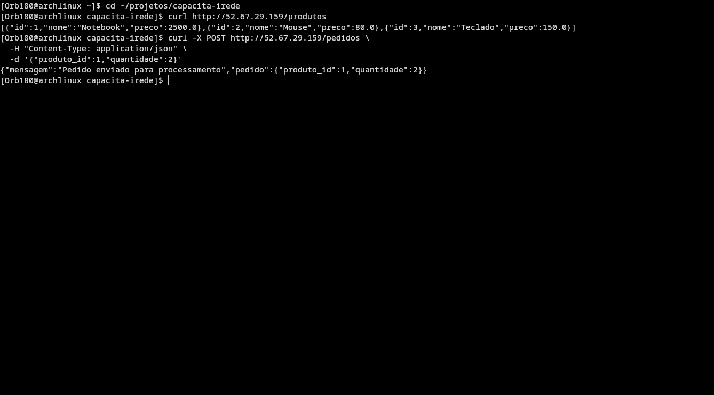
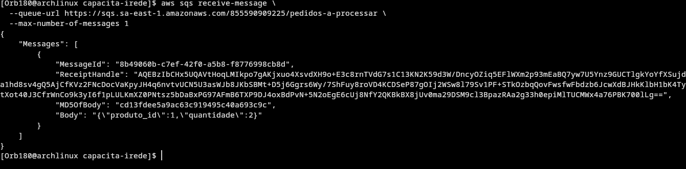
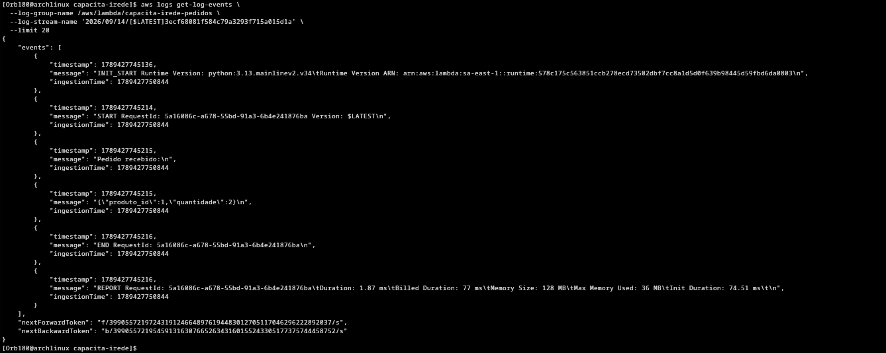
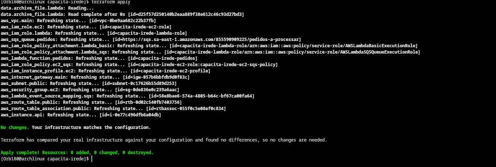

# CapacitaIrede

Projeto de provisionamento de infraestrutura na AWS com Terraform: API de Produtos, API de Pedidos e processamento assíncrono de pedidos via Amazon SQS e AWS Lambda, com registro das informações sendo feito no CloudWatch Logs.

## Arquitetura

Usuário → API (EC2) → SQS → Lambda → CloudWatch Logs.

A API de Produtos disponibiliza uma lista básica de produtos. A API de Pedidos recebe um pedido e envia seus dados para a fila Amazon SQS `pedidos-a-processar`.
Quando um pedido é enviado para a API de Pedidos, a aplicação encaminha a mensagem para o SQS, que funciona como intermediária entre a API e a função Lambda. A Lambda possui o SQS como gatilho: quando uma mensagem chega na fila, ela é acionada, processa o pedido e registra as informações no CloudWatch Logs.

## Como executar o Terraform

Acesse o diretório do projeto:

```bash
cd ~/projetos/capacita-irede
```

Inicialize o Terraform:

```bash
terraform init
```

Valide a configuração:

```bash
terraform validate
```

Verifique o plano de execução:

```bash
terraform plan
```

Crie a infraestrutura na AWS:

```bash
terraform apply
```

Quando o Terraform solicitar confirmação, digite `yes`. O apply provisiona a infraestrutura definida no projeto, incluindo a rede, a EC2, o SQS e a Lambda.

## Como acessar a aplicação na EC2

Após a criação da infraestrutura, a aplicação é acessada pelo IP público da EC2. Durante os testes, o IP utilizado foi:

```bash
52.67.29.159
```

Para consultar a API de Produtos:

```bash
curl http://52.67.29.159/produtos
```

A API de Pedidos utiliza o endpoint `POST /pedidos`.

## Como testar o fluxo de pedidos

Para enviar um pedido:

```bash
curl -X POST http://52.67.29.159/pedidos \
  -H "Content-Type: application/json" \
  -d '{"produto_id":1,"quantidade":2}'
```

Resposta da API:

```json
{
  "mensagem": "Pedido enviado para processamento",
  "pedido": {
    "produto_id": 1,
    "quantidade": 2
  }
}
```

Após o envio, o pedido percorre o fluxo: API na EC2 → SQS → Lambda → CloudWatch Logs, correspondendo ao fluxo esperado pelo oq foi pedido.

## Evidências

**EC2 com aplicação rodando:** foi realizado um teste diretamente contra a aplicação hospedada na EC2. A API de Produtos respondeu corretamente e um pedido foi enviado com sucesso.



**Mensagem chegando no SQS:** foi verificado que a mensagem enviada pelo fluxo de pedidos chegou à fila `pedidos-a-processar` contendo os dados `{"produto_id": 1, "quantidade": 2}`.



**Log da Lambda no CloudWatch:** após o recebimento da mensagem pelo SQS, a Lambda foi acionada e processou o pedido. O CloudWatch Logs registrou:

```
START RequestId: ...

Pedido recebido:
{"produto_id":1,"quantidade":2}

END RequestId: ...
REPORT RequestId: ...
```



**Saída do terraform apply:** a execução concluída apresentou o resultado abaixo, comprovando o provisionamento dos recursos do projeto.

```
Apply complete! Resources: 10 added, 0 changed, 0 destroyed.
```



